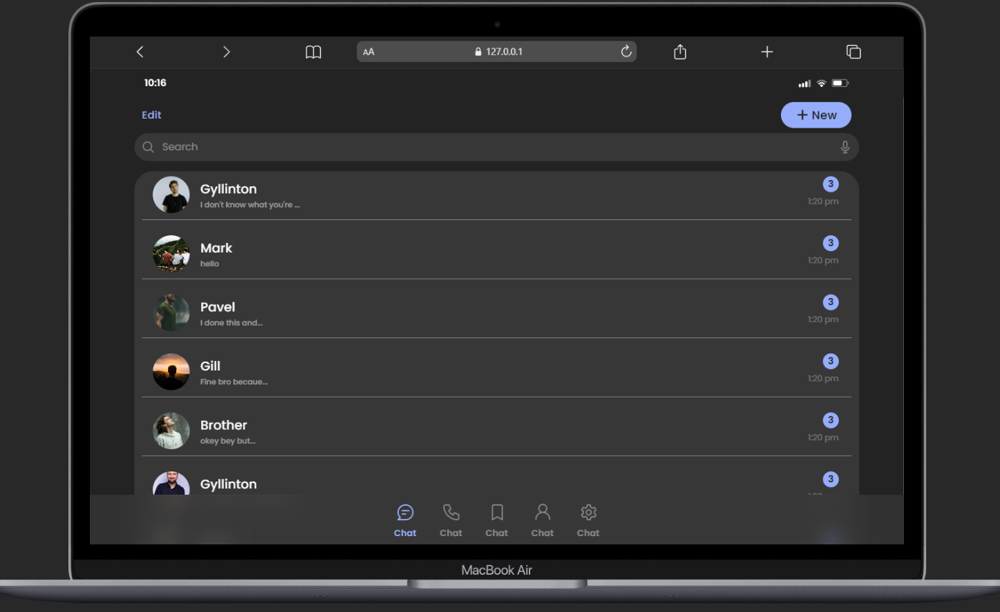
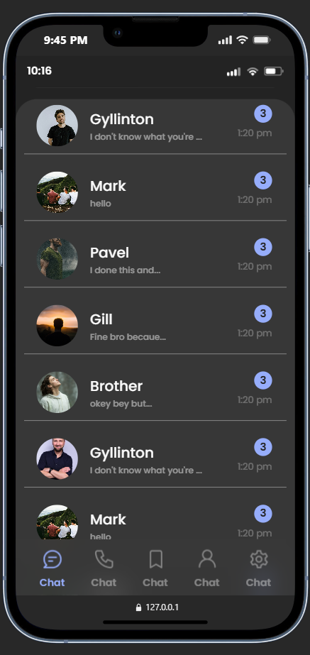
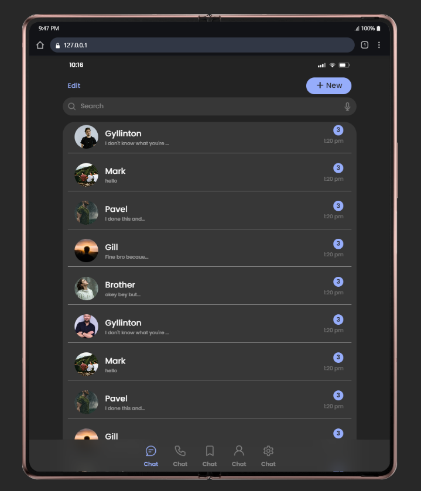
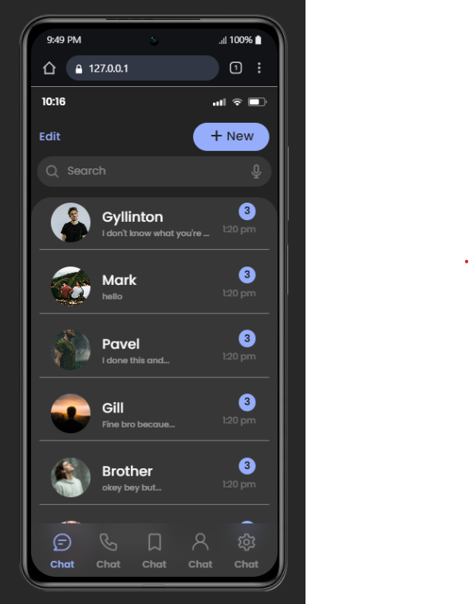

# Chat UI - Modern & Responsive Messaging Interface

**Chat UI** is a sleek, modern, and highly interactive messaging interface designed for seamless user communication. This project focuses on a clean aesthetic, intuitive navigation, and fluid responsiveness across all device sizes, making it perfect for chat applications or customer support dashboards.

## 📸 Screenshots

| Desktop View                          | Mobile View                          |
| :------------------------------------ | :----------------------------------- |
|      |      |
|      |      |

## 🔗 Live Preview

[](https://kumawatpreetam.github.io/chatUI/) 

## 🚀 Key Features

- **Modern UI/UX:** A glassmorphism-inspired design with a focus on readability and user engagement.
- **Fully Responsive:** Built with SCSS and custom media queries to ensure the interface looks great on mobile, tablets, and desktops.
- **Dynamic Messaging Layout:** Optimized message bubbles and sidebars for a realistic chat experience.
- **SCSS Architecture:** Modular styling using variables and mixins for easy customization and maintenance.
- **Cross-Browser Compatibility:** Tested for consistent performance across Chrome, Firefox, Safari, and Edge.

## 🛠️ Tech Stack

- **HTML5:** Semantic structure for accessibility and SEO.
- **SCSS/CSS3:** Advanced styling using Sass for better hierarchy and nested styles.
- **JavaScript:** Handles interactive UI elements and dynamic behavior.
- **Google Fonts:** Integrated high-quality typography for a professional look.

## 📂 Project Structure

```text
├── index.html         # Main HTML structure
├── style.scss         # Source Sass file with variables and mixins
├── style.css          # Compiled production stylesheet
├── style.css.map      # Source map for debugging
└── assets/            # Media assets (Images, Icons, and Illustrations)
```
## ⚙️ Installation & Setup

Follow these steps to get a local copy of the project up and running:

1. **Clone the Repository:**

   ```bash
   https://github.com/kumawatpreetam/chatUI.git
   ```

2. **Run Locally:**

- Simply open index.html in your preferred browser.
- For the best development experience, use the Live Server extension in VS Code.

## 👨‍💻 Developer Details

| Field                | Details                                                                       |
| :------------------- | :---------------------------------------------------------------------------- |
| **Role**             | Frontend Developer                                                            |
| **Technical Skills** | HTML, CSS, SCSS, JavaScript, Bootstrap, Java, and C                           |
| **GitHub**           | [github.com/kumawatpreetam](https://github.com/kumawatpreetam)                |
| **LinkedIn**         | [linkedin.com/in/kumawatpreetam](https://www.linkedin.com/in/kumawatpreetam/) |

---

<p align="center">
  Developed with ❤️ by <a href="https://github.com/kumawatpreetam">Preetam Kumawat</a>
</p>
